Bullet Scan Examples
================

## Breakoff

This is a goldilocks problem - we want to see some breakoff at the
bottom, but we also want a good amount of striae. Scans 1-2 have not
enough striae and no breakoff; scans 3-5 have mostly breakoff and very
little striae.
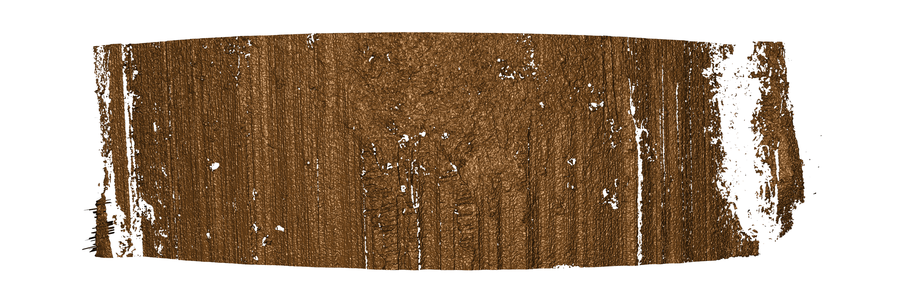<!-- -->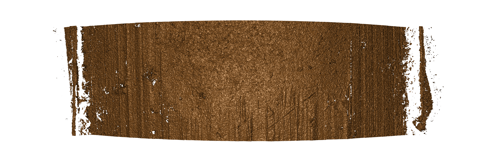<!-- -->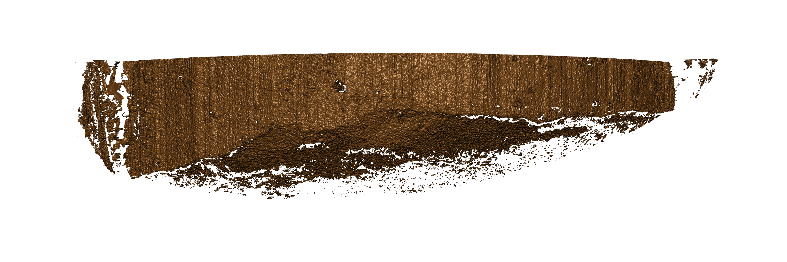<!-- -->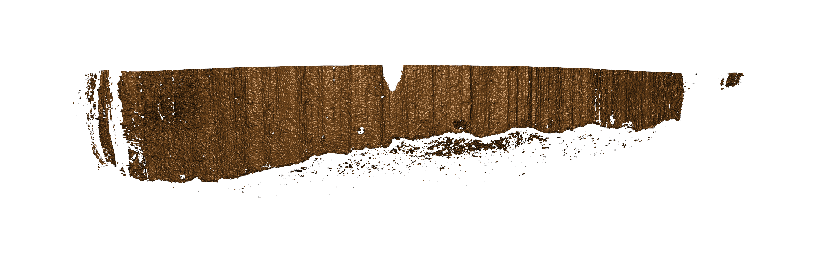<!-- -->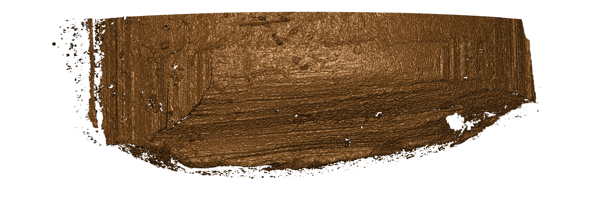<!-- -->

## Groove Engraved Areas

GEAs are narrower than Land engraved areas (LEAs).
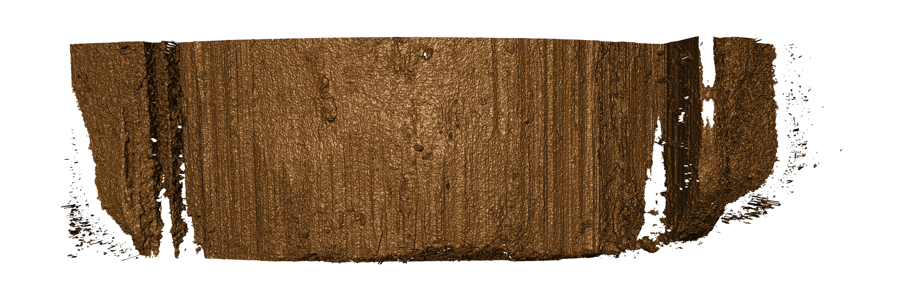<!-- -->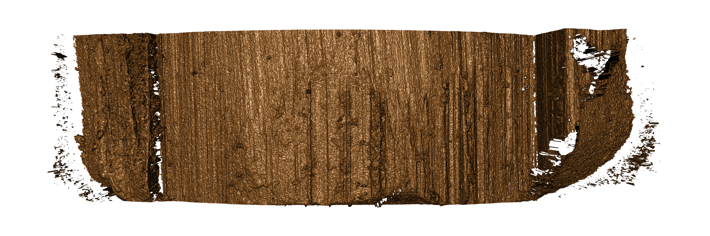<!-- -->

## Misaligned

Alignment is also important - the bullet should not be tilted one way or
another.
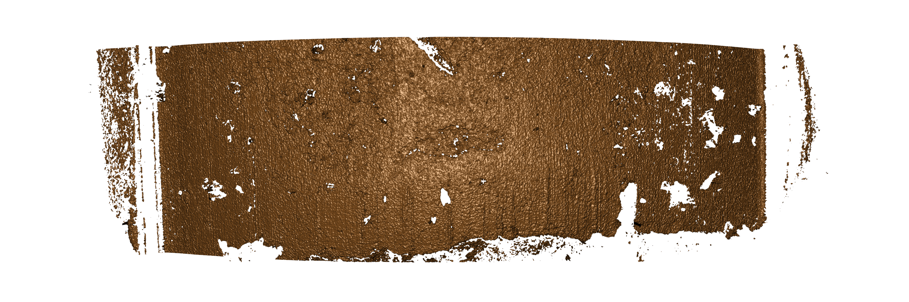<!-- -->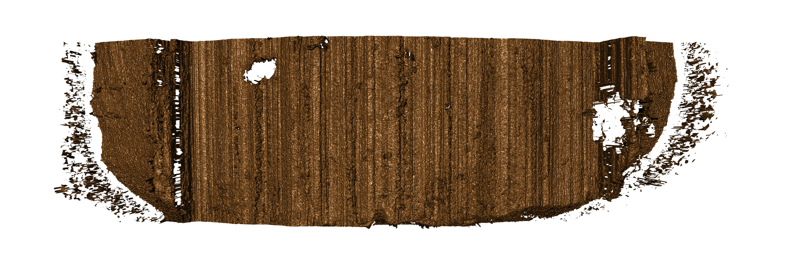<!-- -->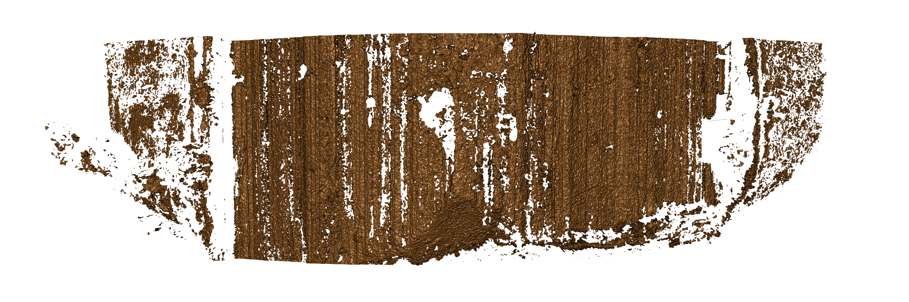<!-- -->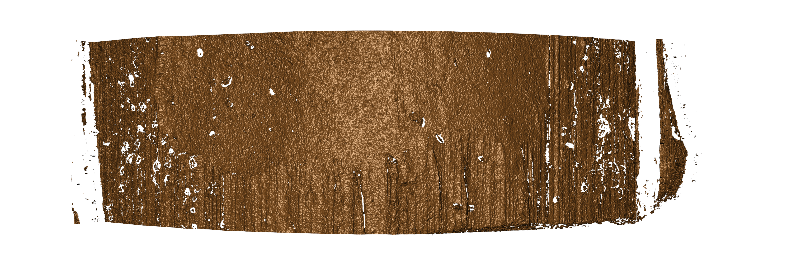<!-- -->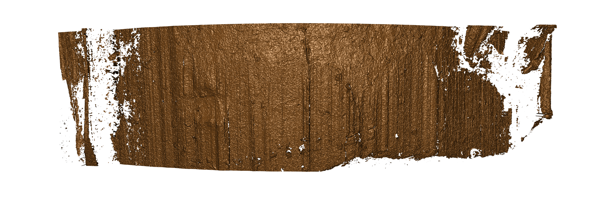<!-- -->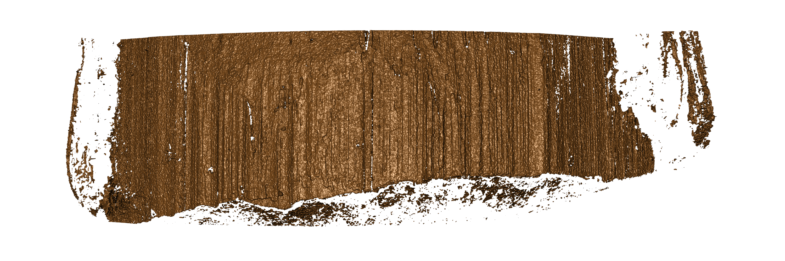<!-- -->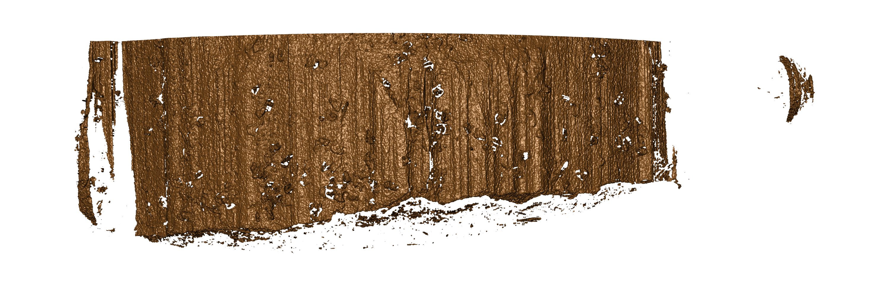<!-- -->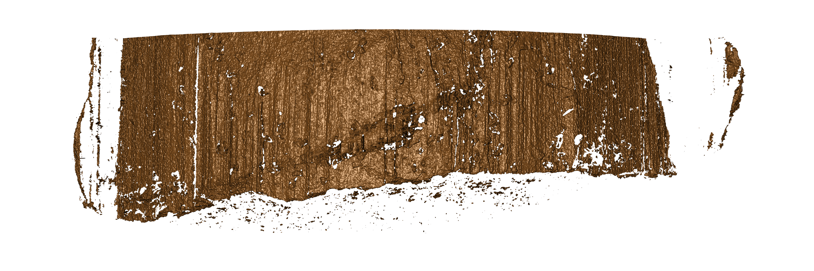<!-- -->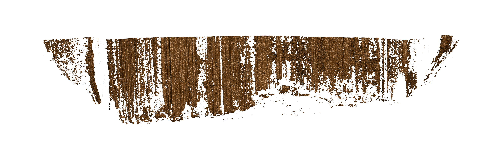<!-- -->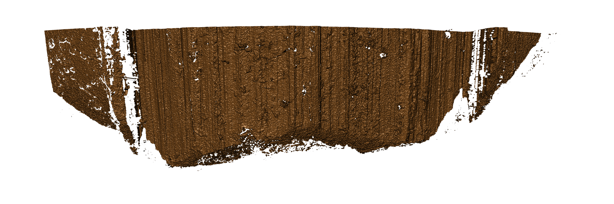<!-- -->

## Tank rash or pitting

This probably can’t be completely helped, as it’s an artifact of the
bullet itself, but here’s what it looks like
anyways:

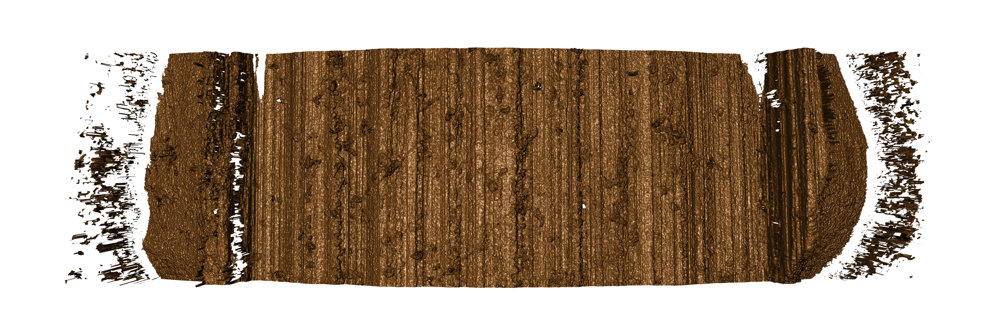<!-- -->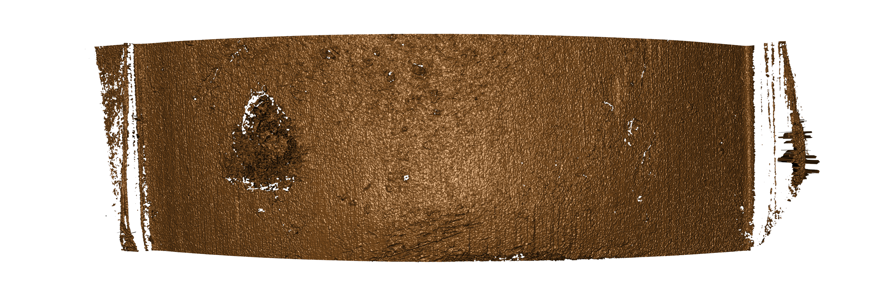<!-- --><!-- -->

## Good scans

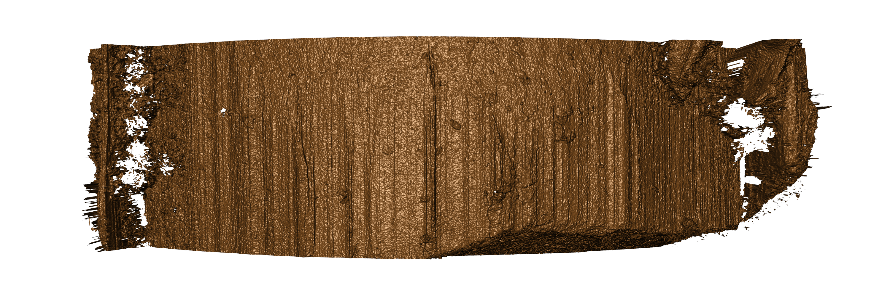<!-- -->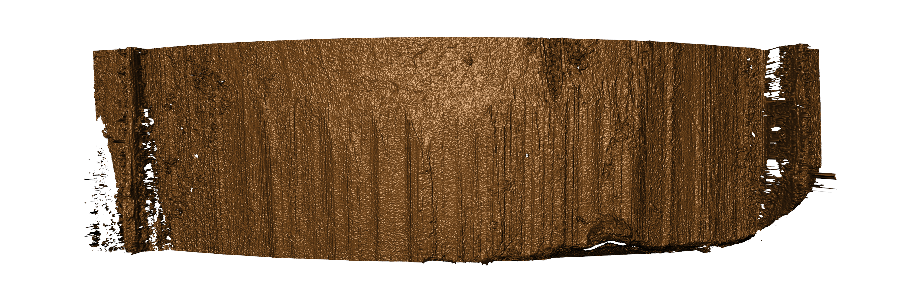<!-- --><!-- -->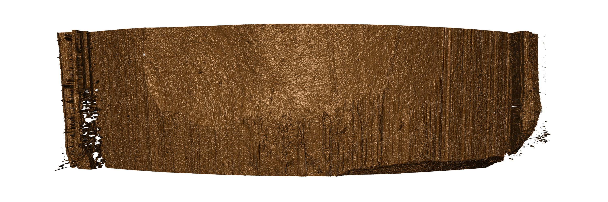<!-- -->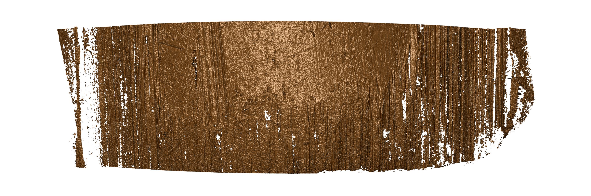<!-- -->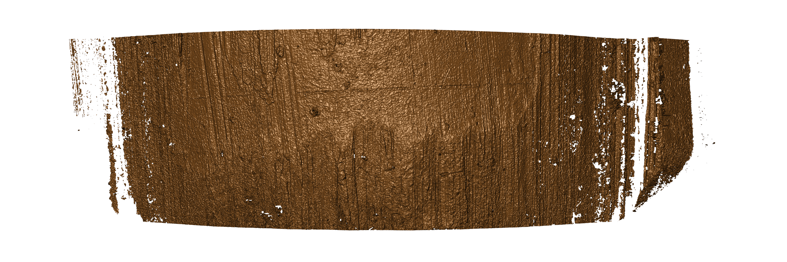<!-- -->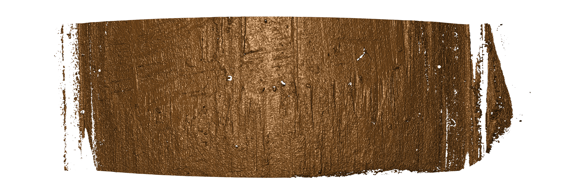<!-- -->
